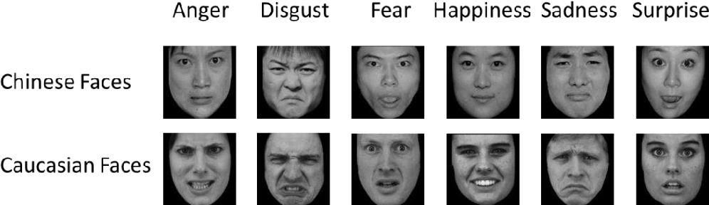

# 😄 Facial Expression Recognition with CNN

   

## Description

This project applies deep learning (Convolutional Neural Networks - CNN) to recognize human facial expressions from static grayscale images. The dataset used is FER2013, consisting of 48x48 pixel images.

## Dataset
- **Source**: FER2013 (Facial Expression Recognition)  
- **Samples**: ~35,000 images labeled with 7 emotions:
  - Angry, Disgust, Fear, Happy, Sad, Surprise, Neutral

## Model Architecture
- Multiple convolution and pooling layers
- ReLU activation function
- Batch Normalization
- Dropout layers to reduce overfitting
- Softmax classifier at the output layer

## Results
- Achieved ~66% accuracy on the validation set
- Confusion matrix shows strong classification performance on emotions like *Happy* and *Neutral*

## Tools & Frameworks
- Python (Keras, TensorFlow)
- Google Colab

---

🔗 [View Project Repository](https://github.com/anhheo2710/Recommendation-System-for-E-commerce)
