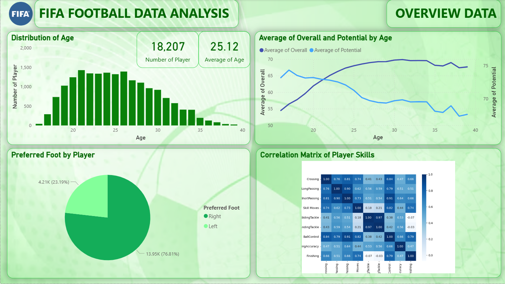

## ⚽ Football Player Analysis
---
## Description
This project analyzes FIFA player data to uncover trends in player skills, market value, and position distribution.

## Folder Structure
- 📁 `data/`: Cleaned dataset (`fifa_eda_stats.csv`)
- 📁 `dashboard/`: Power BI dashboard (`.pbix`)
- 📁 `report/`: Project presentation slide (`.pdf`)

## Tools Used
- Power BI
- Excel / Google Sheets
- Python (for preprocessing)

## Key Highlights
- Cleaned player value formats (e.g., “€1.2M” → 1200000)
- Created interactive visualizations using Power BI: bar charts, pie charts, treemaps, etc.
- Conducted analysis on:
  - Most common playing positions
  - Average player value by nationality
  - Distribution of age and player ratings

## Overview

  

