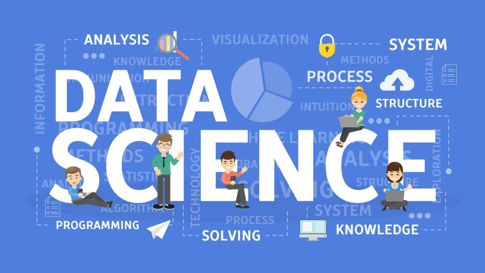

<h1 align="center">✨ Portfolio – Đặng Thị Kim Anh ✨</h1>

  🎓 Data Science Graduate | Aspiring Data Analyst | BI & BA Enthusiast 
  📍 Ho Chi Minh City, Vietnam | 📧 anhh27102003@gmail.com

---

## 📌 About Me

Hello! I'm Kim Anh, a recent graduate in Data Science from Ho Chi Minh University of Science (HCMUS).  
I love working with data to discover insights, build visual stories, and solve business problems.  
My strengths lie in both **Business Intelligence** and **Business Analytics**, using tools like **Power BI, Python, and SQL**.

---

## 🔎 Skills Overview

| Domain               | Tools & Technologies |
|---------------------|----------------------|
| **Programming**      | Python, SQL, R, C/C++ |
| **BI Tools**         | Power BI, Excel, Google Data Studio |
| **Libraries**        | pandas, numpy, matplotlib, seaborn, scikit-learn, tensorflow |
| **Databases**        | MySQL, SQL Server |
| **Soft Skills**      | Reporting, Research, Communication, Teamwork |

---

## 🧠 Highlight Projects

### 📊 1. Football Player Analysis (Power BI)

- Built interactive dashboards analyzing football stats from a FIFA dataset
- Transformed raw text (e.g., `€1.2M`) into numerical values for visualization
- Visualized player positions, nationalities, club distribution, and value insights
- 🖼️ [Dashboard Link (Google Drive)](https://drive.google.com/drive/folders/1LK_uvjss9FNfnwNrACuUkjj6yVD8a_Vc)

---

### 🤖 2. Facial Expression Recognition (CNN)

- Used the FER2013 dataset (~35k grayscale images) to classify facial emotions
- Applied Convolutional Neural Networks using TensorFlow (Accuracy ~60%)
- Visualized model performance with confusion matrix and plots
- 📁 [View on GitHub](https://github.com/anhheo2710/Fundamental-ML)

---

### 🎯 3. Recommendation System (Collaborative Filtering)

- Implemented Non-personalized, Content-Based, and Collaborative Filtering models
- Cleaned and analyzed user-item interaction data
- Built recommendation engine using Python
- 📁 [View on GitHub](https://github.com/anhheo2710/Recommendation-System)

---

## 🧾 Certifications

- ✅ **Data Processing with Python – Udemy** *(In Progress)*  
- ✅ **VSTEP B1 English Certificate**

---

## 📫 Contact

- 📧 Email: [anhh27102003@gmail.com](mailto:anhh27102003@gmail.com)  
- 🔗 GitHub: [github.com/anhheo2710](https://github.com/anhheo2710)  
- 📍 Location: Ho Chi Minh City, Vietnam  

---

> 💬 *"Turning data into action, one insight at a time."*
