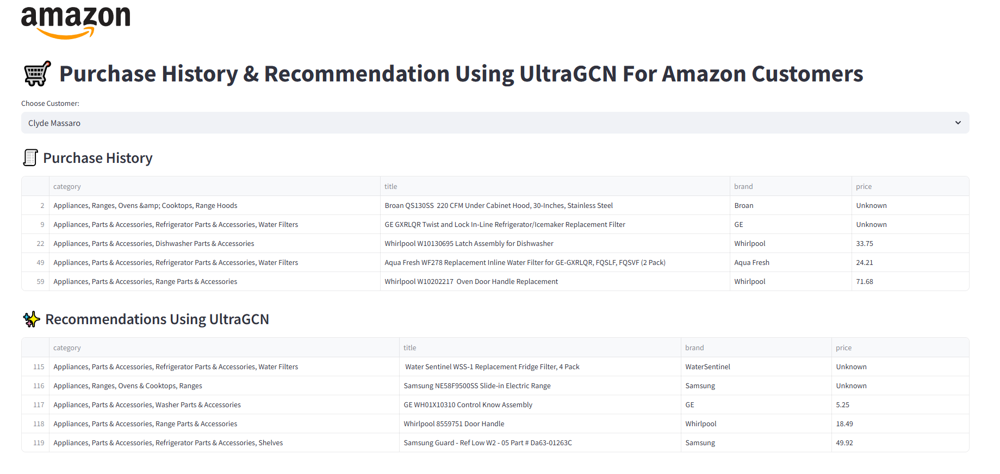

## 🛒 Recommendation System for E-commerce

A graduation project applying deep learning models (MF, NCF, MLP, LightGCN, UltraGCN) to build a product recommendation system using Amazon Appliance Dataset.

Highlights:
- Built end-to-end data pipeline: Preprocessing → Training → Evaluation → Deployment
- Compared model performance using metrics: Precision@10, Recall@10, NDCG, RMSE, MAE
- Deployed interactive demo via Streamlit

   

🔗 [View Project Repository](https://github.com/anhheo2710/Recommendation-System-for-E-commerce)
